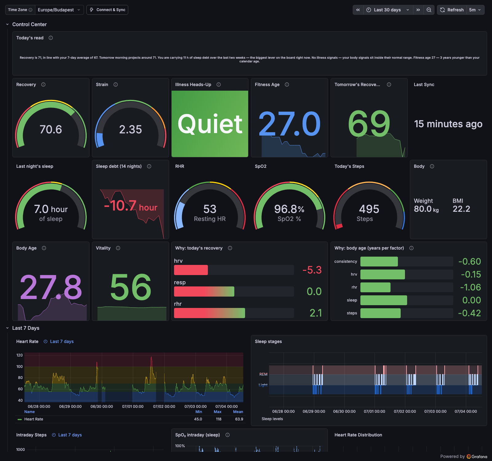
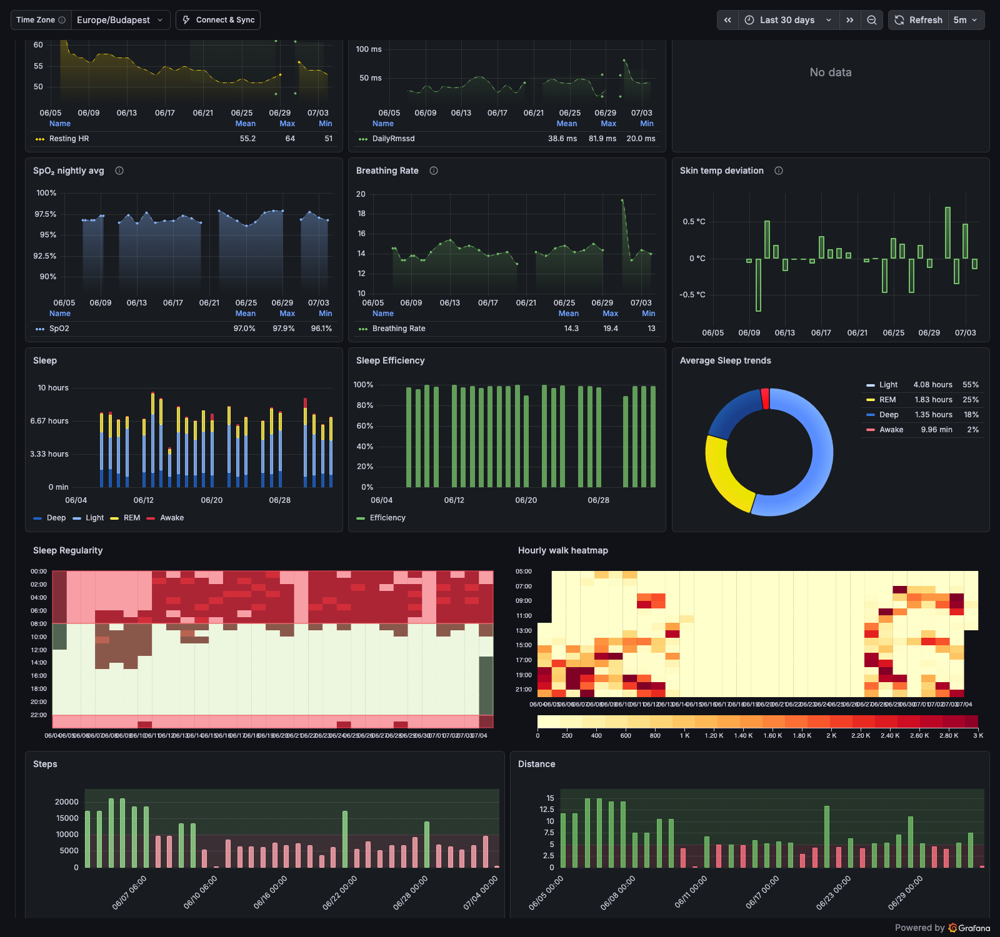

# Local Health Dashboard

A self-hosted health dashboard for **Fitbit / Pixel Watch** devices (including the
Fitbit Air). It pulls your data from the **Google Health API**, stores it in a local
InfluxDB, and renders a Grafana dashboard with WHOOP-style scores on top — Recovery,
Strain, an illness early-warning, personal vital ranges, and a sleep-debt ledger.

Everything runs on your machine. Your health data never leaves it — the only network
calls are read-only pulls from your own Google account.



<details><summary>History & Algorithms section</summary>



</details>

> [!IMPORTANT]
> *Fitbit is a registered trademark of Google LLC. Grafana is a registered trademark of
> Grafana Labs. This is an independent, open-source tool, not affiliated with or endorsed
> by Google LLC or Grafana Labs. The derived scores are wellness estimates, not medical
> advice or diagnosis.*

## What you get

- **Raw metrics** — heart rate (intraday), resting HR, HRV, steps, sleep stages,
  SpO₂, breathing rate, skin temperature, workouts.
- **Recovery (0–100)** — HRV vs your personal baseline, resting HR, sleep performance,
  respiration, folded through the WHOOP-style model.
- **Strain (0–21)** — Edwards TRIMP over the day's intraday heart rate.
- **Illness heads-up** — fires when ≥2 of resting-HR↑ / HRV↓ / respiration↑ /
  skin-temp↑ move together against your own baseline (the published pre-symptomatic
  signature), with a provisioned Grafana alert rule.
- **Personal vital bands** — your own normal range drawn behind resting HR and HRV,
  instead of population cutoffs.
- **Sleep debt** — a rolling 14-night ledger of slept-vs-need.
- **Fitness Age & Body Age** — a Nes-2011 fitness comparison and a mortality-hazard
  "Body Age" (the WHOOP-Age method), each with a per-factor "why" breakdown.
- **Tomorrow's recovery forecast** — an evening estimate with an honest ± band,
  charted against what actually happened.
- **"Today's read"** — a rule-based plain-language summary regenerated hourly.
- **Body clock** — a cosinor fit over your rest–activity rhythm: activity acrophase,
  estimated temperature minimum, and how far your clock leans vs your own schedule.
  Includes a jet-lag planner: `docker exec compute-metrics python compute_metrics.py
  --plan-shift +6` prints a stepped light/sleep-timing plan (never a supplement).

Baselines are personal and honest: scores cold-start until enough nights exist
(4 for Recovery, 14 for the illness watch and bands).

## Quickstart

Prerequisites: Docker + Docker Compose, Python 3.10+.

**1. Create a Google OAuth client** at [console.cloud.google.com](https://console.cloud.google.com):
APIs & Services → Credentials → Create OAuth client ID → type **Desktop app**.
Then, under **OAuth consent screen**, add yourself as a user and **publish the app to
production** — apps left in "Testing" status get refresh tokens that expire every
7 days, which silently kills the sync. (Your app stays unverified; you just click
through one warning at sign-in.)

**2. Launch:**

```bash
cp .env.example .env      # fill in GOOGLE_CLIENT_ID / GOOGLE_CLIENT_SECRET
mkdir -p logs tokens && docker compose up -d
```

**3. Connect:** open **http://localhost:8000** and click **Connect Google Health**.
Your browser runs Google's consent flow; on success a 28-day backfill is queued
automatically. The same page shows token/data health and has re-sync and backfill
buttons whenever you want fresh data.

Then open the dashboard at **http://localhost:3000** (admin / admin) — the InfluxDB
datasource and dashboard are provisioned automatically, and its header links back to
the Connect & Sync page. Data keeps flowing on a schedule (recent data every few
minutes, daily series every few hours; scores recompute hourly).

Headless machine with no browser? `python3 get_google_token.py` on any computer
writes `tokens/fitbit.token`; copy it over.

If InfluxDB fails to start on a permission error: `sudo chown -R 1500:1500 influxdb`.
The `logs`/`tokens` folders must be writable by uid 1000 (the fetcher container user).

## Historical backfill

To pull months of past data, stop the stack, then run the fetcher in bulk mode:

```bash
docker compose stop fitbit-fetch-data
docker compose run --rm -e AUTO_DATE_RANGE=False \
  -e MANUAL_START_DATE=2025-01-01 -e MANUAL_END_DATE=2026-01-01 fitbit-fetch-data
docker compose up -d
```

Split very large ranges into ~1-year chunks. The InfluxDB schema is documented in
[extra/influxdb_schema.md](extra/influxdb_schema.md).

## Alerts

The "Illness heads-up raised" alert rule ships in the dashboard provisioning but
notifies Grafana's default (unconfigured) contact point. To get actual pushes, add a
contact point (ntfy, Telegram, email…) under Alerting → Contact points and set it as
the default notification policy.

## Backup

InfluxDB holds the only copy of your data:

```bash
docker exec influxdb influxd backup -portable -db FitbitHealthStats /tmp/backup
docker cp influxdb:/tmp/backup ./influxdb_backups/$(date +%F)
docker exec influxdb rm -r /tmp/backup
```

## Architecture

Three containers plus a scorer:

| Service | Role |
|---|---|
| `fitbit-fetch-data` | Polls the Google Health API v4 (`health.googleapis.com`), writes raw measurements to InfluxDB. Handles pagination, proactive token refresh, and bulk backfill. |
| `compute-metrics` | Recomputes the derived scores hourly from whatever is in InfluxDB (`compute_metrics.py`, stdlib only). |
| `influxdb` | InfluxDB 1.11, bind-mounted to `./influxdb`. |
| `grafana` | Grafana with the datasource + dashboard provisioned from `./provisioning`. |

## Credits & license

- Built on [arpanghosh8453/fitbit-grafana](https://github.com/arpanghosh8453/fitbit-grafana)
  by Arpan Ghosh — the fetcher and stack layout descend from that project (see `LICENSE`).
- The Recovery / Strain / illness-watch / vital-bands / sleep-debt algorithms are
  ported from [NOOP](https://github.com/NoopApp/noop)'s StrandAnalytics, licensed
  **PolyForm Noncommercial 1.0.0** — so this project as a whole is for
  **noncommercial use only**.
